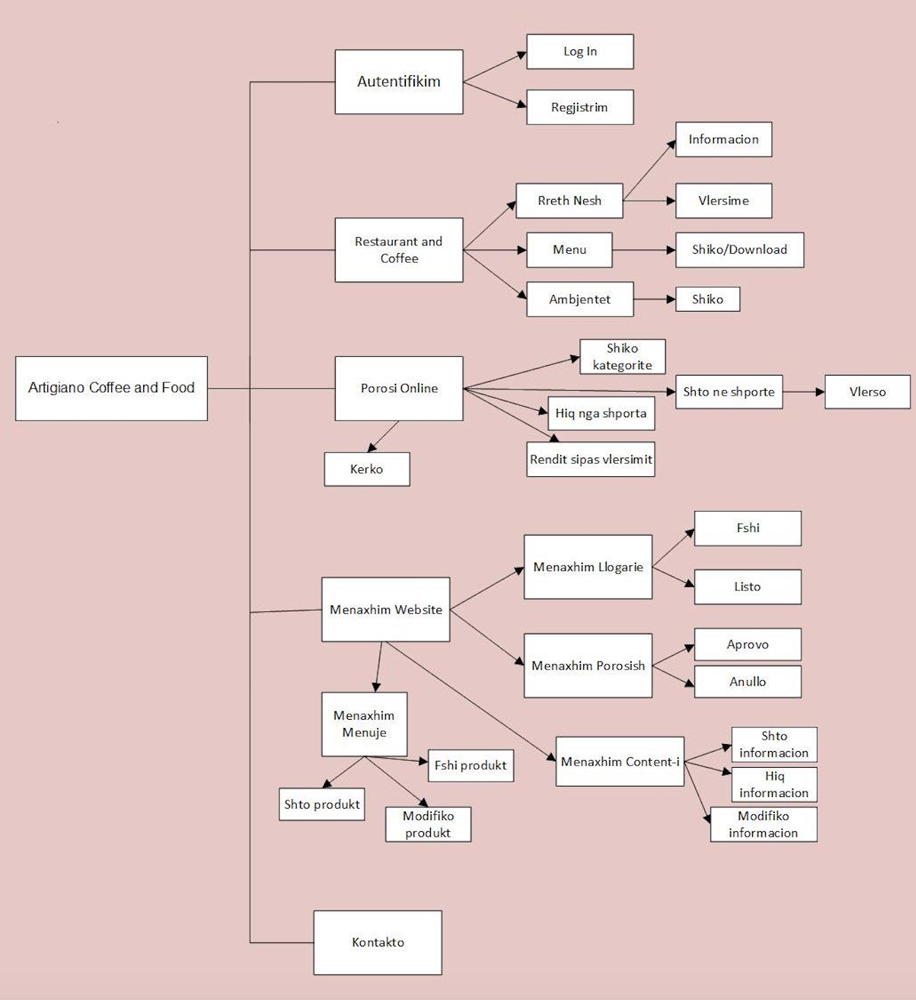

# Artigiano_restaurant_web

## Artigiano Coffee and Food

The Project consists in creating a website for the _Artigiano_ Restaurant in Albania. 

Users will be offered to view the dinning rooms, to browse menus, to subscribe, to make order in specific areas of Tirana, and explore offers. All the appropriate entities will be managed in a CRUD-like fashion by Web Site administrators. 

Technology Stack:
AJAX, JQuery, HTML, CSS, JavaScript, PHP, SQL Server, etj.

Document Creation Tools:
Visio, Violet. 

_Tested in XAMPP Apache, PHP 5.6:_
http://localhost/PROJEKT_WEB/Artigiano.php

_Database:_
projekt_web.sql 

_Login as Admin:_
**username**: kejsi
**password**: admin2016

_Login as a Registered User_
**username**: ana
**password**: user12016
  or
**username**: jola
**password**: user22016

